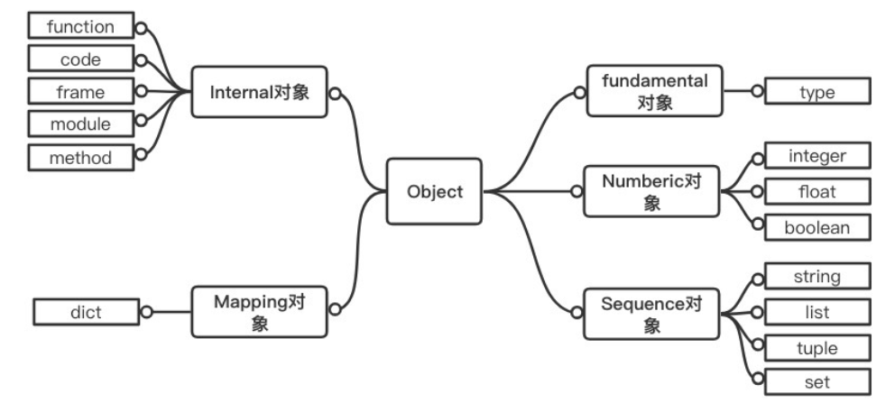
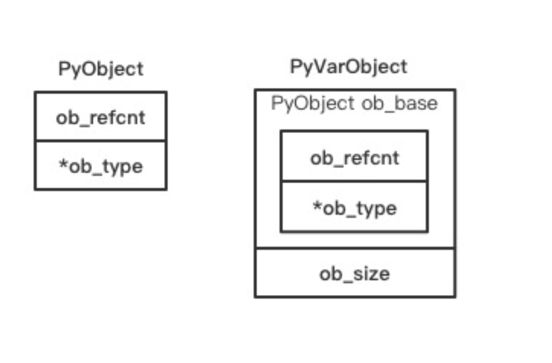
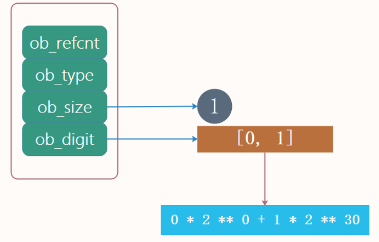
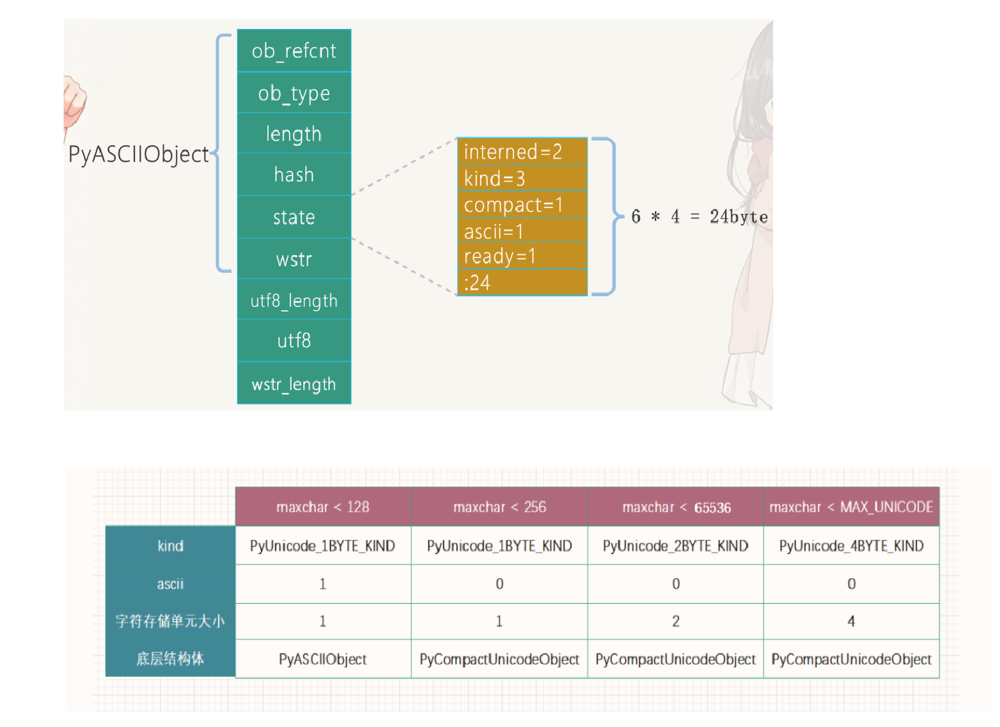
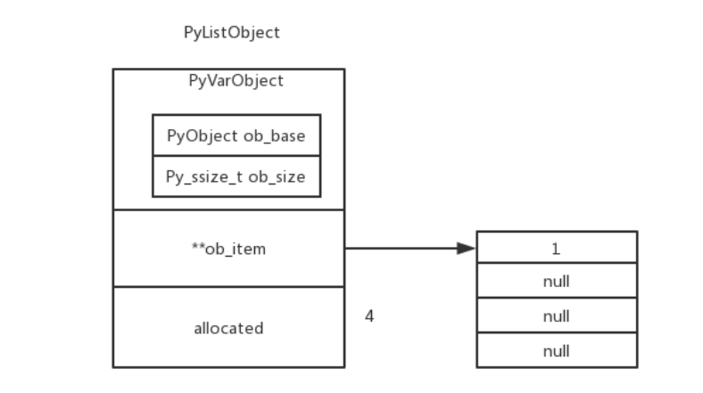
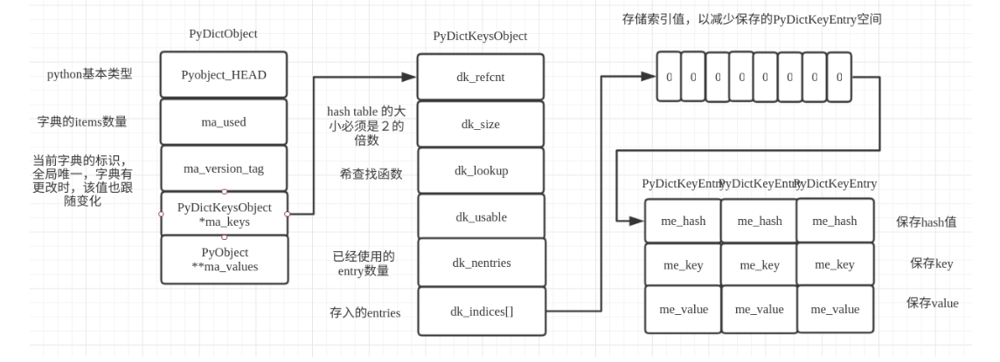
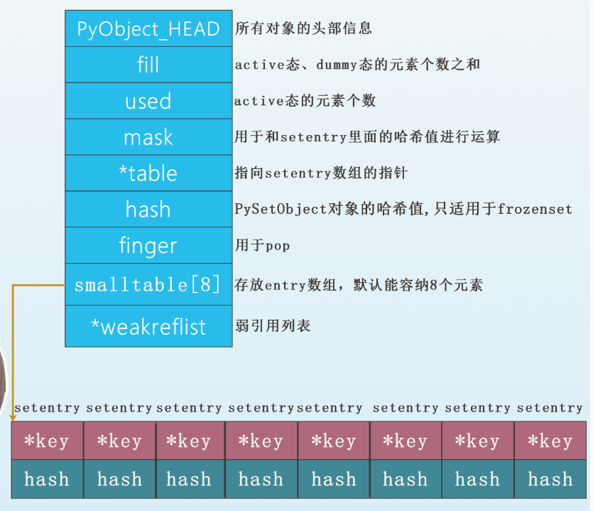

## Acknowledgements

博客园：古明地盆，[源码分析系列](https://www.cnblogs.com/traditional/)  

[《Python 源码剖析》](https://github.com/flaggo/python3-source-code-analysis)


## Python一切皆对象

### 1.1  Python对象 



- Fundamental 对象: 类型对象
- Numeric 对象: 数值对象
- Sequence 对象: 容纳其他对象的序列集合对象
- Mapping 对象: 类似 C++中的 map 的关联对象
- Internal 对象: Python 虚拟机在运行时内部使用的对象 


### 1.2 对象机制的基石 PyObject和PyVarObject

PyObject 包含 一个用于垃圾回收的双向链表，一个引用计数变量 `ob_refcnt` 和 一个类型对象指针`ob_type`



### 1.3 类型对象的基石--PyTypeObject

我们提到了**PyObject** 和 **PyVarObject** 对象类型指针`struct _typeobject *ob_type`，它指向的类型对象就决定了一个对象是什么类型的。

```
typedef struct _typeobject {
    PyObject_VAR_HEAD
    const char *tp_name; /* For printing, in format "<module>.<name>" */ // 类型名
    Py_ssize_t tp_basicsize, tp_itemsize; /* For allocation */
    // 创建该类型对象分配的内存空间大小

    // 一堆方法定义，函数和指针
    /* Methods to implement standard operations */
    destructor tp_dealloc;
    printfunc tp_print;
    getattrfunc tp_getattr;
    setattrfunc tp_setattr;
    PyAsyncMethods *tp_as_async; /* formerly known as tp_compare (Python 2)
                                    or tp_reserved (Python 3) */
    reprfunc tp_repr;

    /* Method suites for standard classes */
    // 标准类方法集
    PyNumberMethods *tp_as_number;  // 数值对象操作
    PySequenceMethods *tp_as_sequence;  // 序列对象操作
    PyMappingMethods *tp_as_mapping;  // 字典对象操作

    // 更多标准操作
    /* More standard operations (here for binary compatibility) */
    hashfunc tp_hash;
    ternaryfunc tp_call;
    reprfunc tp_str;
    getattrofunc tp_getattro;
    setattrofunc tp_setattro;

    ......

} PyTypeObject;
```

其中PyTypeObject内部几个非常关键的成员：

- `PyObject_VAR_HEAD：我们说这是一个宏，对应一个PyVarObject，所以类型对象是一个变长对象。而且类型对象也有引用计数和类型，这与我们前面分析的是一致的。`
- `tp_name：类型的名称，而这是一个char *，显然它可以是int、str、dict之类的。`
- `tp_basicsize, tp_itemsize：创建对应实例对象时所需要的内存信息。`
- `tp_dealloc：其实例对象执行析构函数时所作的操作。`
- `tp_print：其实例对象被打印时所作的操作。`
- `tp_as_number：其实例对象为数值时，所支持的操作。这是一个数组指针，指向了一个指针数组，指向的指针数组中存储了大量的函数指针，其函数就是整型对象可以执行的操作，比如：四则运算、左移、右移、取模等等`
- `tp_as_sequence：其实例对象为序列时，所支持的操作。同样是一个数组指针，指向一个指针数组。`
- `tp_as_mapping：其实例对象为映射时，所支持的操作。也是一个数组指针，指向一个指针数组。`
- `tp_base：继承的基类。`


## 1.4 类型对象 

在 **PyTypeObjet** 定义开始有一个宏`PyOject_VAR_HEAD`，查看源码可知 **PyTypeObjet** 是一个变长对象 

```
// Include/object.h
#define PyObject_VAR_HEAD      PyVarObject ob_base;
```

对象的类型是由该对象指向的 类型对象 决定的，那么类型对象的类型是由谁决定的呢？ 对于其他对象，可以通过与其关联的类型对象确定其类型，那么通过什么来确定一个对象是类型对象呢？ 答案就是 `PyType_Type` 

```
// Objects/typeobject.c
PyTypeObject PyType_Type = {
    PyVarObject_HEAD_INIT(&PyType_Type, 0)
    "type",                                     /* tp_name */
    sizeof(PyHeapTypeObject),                   /* tp_basicsize */
    sizeof(PyMemberDef),                        /* tp_itemsize */

    ......
};
```

以`PyLong_Type`为例，可以清晰的看到一般的类型对象和`PyType_Type`之间的关系 

```
// Objects/longobject.c

PyTypeObject PyLong_Type = {
    PyVarObject_HEAD_INIT(&PyType_Type, 0)
    "int",                                      /* tp_name */
    offsetof(PyLongObject, ob_digit),           /* tp_basicsize */
    sizeof(digit),                              /* tp_itemsize */

    ......
};
```

## Python的对象创建和销毁 

### 1. Python/C API  
**范型 API 或称为 AOL (Abstract Object Layer)**

这类 API 通常形如`PyObject_XXX`这样的形式。可以应用在任何 Python 对象上， 如`PyObject_New`。创建一个整数对象的方式

```c
PyObject* longobj = PyObject_New(Pyobject, &PyLong_Type);
```

**与类型相关的 API 或称为 COL (Concrete Object Layer)**

这类 API 通常只能作用于某一种类型的对象上，对于每一种内建对象 Python 都提供了这样一组 API。例如整数对象，我们可以利用如下的 API 创建

```c
PyObject *longObj = PyLong_FromLong(10);
```

```
pi = 3.14  # 通过Python/C API创建  
pi = float(3.14)  # # 通过类型对象创建 
lst = []  #  通过Python/C API创建
lst = list()  # 通过类型对象创建
```

> 通过Python/C API创建，会直接解析为对应的C一级数据结构,不需要进行参数解析、类型检测、创建栈帧、销毁栈帧等等，速度要快一些  


### 2.2 对象的多态性 

Python 创建一个对象比如 **PyLongObject** 时，会分配内存进行初始化，然后 Python 内部会用 `PyObject` 的泛型指针来保存和维护这个对象，而不是PyFloatObject ; 其他对象也与此类似.

我们不知道这个指针所指的对象是什么类型，只能通过所指对象的 `ob_type` 域 动态进行判断，而 Python 正是通过 `ob_type` 实现了多态机制

考虑以下的 calc_hash 函数

```c
Py_hash_t
calc_hash(PyObject* object)
{
    Py_hash_t hash = object->ob_type->tp_hash(object);
    return hash;
}
```

如果传递给 calc_hash 函数的指针是一个 `PyLongObject*`，那么它会调用 PyLongObject 对象对应的类型对象中定义的 hash 操作`tp_hash`，`tp_hash`可以在**PyTypeObject**中找到， 而具体赋值绑定我们可以在 `PyLong_Type` 初始化代码中看到绑定的是`long_hash`函数

```c
// Objects/longobject.c
PyTypeObject PyLong_Type = {
    PyVarObject_HEAD_INIT(&PyType_Type, 0)
    "int",                                      /* tp_name */
    ...

    (hashfunc)long_hash,                        /* tp_hash */

    ...
};
```

如果指针是一个 `PyUnicodeObject*`，那么就会调用 PyUnicodeObject 对象对应的类型对象中定义的 hash 操作，查看源码可以看到 实际绑定的是 `unicode_hash`函数

```c
// Objects/unicodeobject.c
PyTypeObject PyUnicode_Type = {
    PyVarObject_HEAD_INIT(&PyType_Type, 0)
    "str",              /* tp_name */

    ...

    (hashfunc) unicode_hash,        /* tp_hash*/

    ...
};
```

### 2.3 引用计数 

Python 通过引用计数来管理维护对象在内存中的存在与否

Python 中的每个东西都是一个对象， 都有`ob_refcnt` 变量，这个变量维护对象的引用计数，从而最终决定该对象的创建与销毁

在 Python 中，主要通过 `Py_INCREF(op)`与`Py_DECREF(op)` 这两个宏 来增加和减少对一个对象的引用计数。当一个对象的引用计数减少到 0 之后， `Py_DECREF`将调用该对象的`tp_dealloc`来释放对象所占用的内存和系统资源；

但这并不意味着最终一定会调用 `free` 释放内存空间。因为频繁的申请、释放内存会大大降低 Python 的执行效率。因此 Python 中大量采用了内存对象池的技术，使得对象释放的空间归还给内存池而不是直接`free`，后续使用可先从对象池中获取 

**导致引用计数加1的情况：**

- `对象被创建：比如name = "mr_menand", 此时对象就是"mr_menand"这个字符串, 创建成功时它的引用计数为1`
- `变量传递使得对象被新的变量引用：比如Name = name`
- `引用该对象的某个变量作为参数传到一个函数或者类中：比如func(name)`
- `引用该对象的某个变量作为元组、列表、集合等容器的一个元素：比如lst = [name]`

**导致引用计数减1的情况：**

- `引用该对象的变量被显示的销毁：del name`
- `对象的引用指向了别的对象：name = "ygg"`
- `引用该对象的变量离开了它的作用域，比如函数的局部变量在函数执行完毕的时候会被销毁`
- `引用该对象的变量所在的容器被销毁，或者被从容器里面删除`


## Python的内建对象 

### 1.float 浮点数对象 

```

typedef struct {
    PyObject_HEAD
    double ob_fval;
} PyFloatObject;
```

> 浮点数这种对象是经常容易被创建和销毁的，如果每创建一个就分配一次内存、每销毁一个就回收一次内存的话，那效率会低到可想而知了。我们知道Python在操作系统之上封装了一个内存池，可以用于小内存对象的快速创建和销毁，这便是Python的内存池机制。但浮点数使用的频率很高，我们有时会创建和销毁大量的临时对象，所以如果每一次对象的创建和销毁都伴随着内存相关的操作的话，这个时候即便是有内存池机制，效率也是不高的


> **因此Python在浮点数对象被销毁后，并不急着回收对象所占用的内存，换句话说其实对象还在，只是将该对象放入一个空闲的链表中。因为我们说对象可以理解为就是一片内存空间，对象如果被销毁，那么理论上内存空间要归还给操作系统，或者回到内存池中；但Python考虑到效率，并没有真正的销毁对象，而是将对象放入到链表中，占用的内存还在；后续如果再需要创建新的浮点数对象时，那么从链表中直接取出之前放入的对象(我们认为被回收的对象)，根据新的浮点数对象重新初始化对应的成员即可，这样就避免了内存分配造成的开销。而这个链表就是我们说的缓存池，当然不光浮点数对象有缓存池，Python中的很多其它对象也有对应的缓存池，比如列表**

```
 
#ifndef PyFloat_MAXFREELIST
#define PyFloat_MAXFREELIST    100   # 缓存池中能容纳float实例对象的最大数量, 显然不可能将所有要销毁的对象都放入到缓存池中, 这里是100个;
#endif 
static int numfree = 0;  # 表示当前缓存池(链表)中的已经存在的float实例对象的数量, 初始为0;
static PyFloatObject *free_list = NULL; # 指向链表头结点的指针, 链表里面存储的都是PyFloatObject, 所以头节点的指针就是PyFloatObject
```

> **Python是使用内部的ob_type来指向下一个对象，本来ob_type指向的应该是PyFloat_Type，但是在链表中指向的是下一个PyFloatObject。**

```
a = 3.14 
id(a) #  2598988869872
del a 
b = 3.68 
id(b) #  2598988869872
```

### 2 int整数对象

> 我们知道Python中的整数是不会溢出的，换句话说，它可以计算无穷大的数。只要你的内存足够，它就能计算，但是对于C来说显然是不行的，可Python底层又是C实现的，那么它是怎么做到整数不会溢出的呢? 

```
typedef struct {
    Py_ssize_t ob_refcnt; //引用计数
    struct _typeobject *ob_type; //类型
    Py_ssize_t ob_size; //维护的元素个数
    digit ob_digit[1]; //digit类型的数组,长度为1
} PyLongObject;
```

ob_size它指的是底层数组的长度,digit等价于uint32_t`(unsigned int)`，所以它是一个无符号32位整型。**虽然digit是4字节、32位，但是Python只用30个位**，一个位的最大整数位2^30-1



小整数池对象

> Python中的整数属于不可变对象，运算之后会创建新的对象。**Python将那些使用频率高的整数预先创建好，而且都是单例模式，这些预先创建好的整数会放在一个静态数组里面，我们称为小整数对象池。如果需要使用的话会直接拿来用，而不用重新创建。注意：这些整数在Python解释器启动的时候，就已经创建了**

```
#ifndef NSMALLPOSINTS
#define NSMALLPOSINTS           257 # NSMALLPOSINTS宏规定了对象池中正数的个数 (从 0 开始，包括 0 )，默认 257 个
#endif
#ifndef NSMALLNEGINTS
#define NSMALLNEGINTS           5 # NSMALLNEGINTS宏规定了对象池中负数的个数，默认5个
#endif

static PyLongObject small_ints[NSMALLNEGINTS + NSMALLPOSINTS];
```

> Python3.8 已做优化，即便是大整数、并且不再同一个编译单元的常量池中，它们的地址也是一样的


## 3 str字符串对象 

python的内部使用了三种编码方式表示Unicode。

- `Latin-1 编码：每个字符一字节;`
- `UCS2 编码：每个字符两字节;`
- `UCS4 编码：每个字符四字节;`

utf-8，不同的字符可能会占用不同的编码，**Python会使用3个编码，对应编码的字符分别是1、2、4字节。因此Python在创建字符串的时候，会先扫描**



### 4  List列表对象 


自动扩容 公式：

`new_allocated = (size_t)newsize + (newsize >> 3) + (newsize < 9 ? 3 : 6);`

会有 0 4 8 16 25 35 46 58 72 88 106 

```
#ifndef PyList_MAXFREELIST
#define PyList_MAXFREELIST 80
#endif
static PyListObject *free_list[PyList_MAXFREELIST];
```

创建PyListObject对象时，会先检测缓冲池free_lists里面是否有可用的对象，有的话直接拿来用，否则通过malloc在系统堆上申请。缓冲池中最多维护80个PyListObject对象。 

**元组的底层结构--PyTupleObject**

```
typedef struct {
    PyObject_VAR_HEAD
    PyObject *ob_item[1];
} PyTupleObject;
```

**tuple的底层是一个变长对象，但同时也是一个不可变对象。** 

元组除了能作为字典的key之外，还有一个特点，就是分配的速度比较快。一方面是因为由于其不可变性，使得在编译的时候就确定了，另一方面就是它还具有静态资源缓存的作用


### 5 Dict字典对象 



解决哈希冲突的常用方法有两种：

- `分离链接法(separate chaining)` ： 分离链接法"为每个哈希槽维护一个链表，所有哈希到同一槽位的键保存到对应的链表中
- `开放寻址法(open addressing)`：
  - 线性探测
  - 平方探测 

**Python采用的便是开放寻址法**。Python为哈希表搜索提供了多种探测函数，lookdict、lookdict_unicode、lookdict_index，一般通用的是lookdict。lookdict_unicode是专门针对key为字符串的entry，lookdict_index针对key为整数的entry，可以把lookdict_unicode、lookdict_index看成lookdict的特殊实现，只不过key是整数和字符串的场景非常常见，因此为其单独实现了一个函数。


**集合PySetObject**

