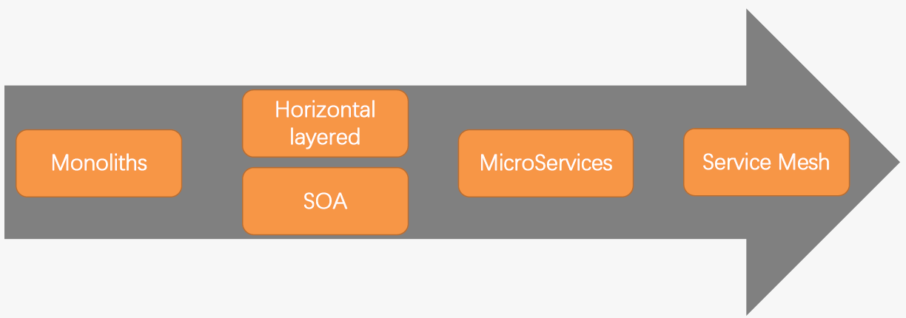
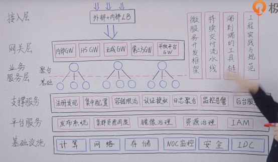
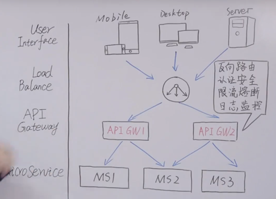
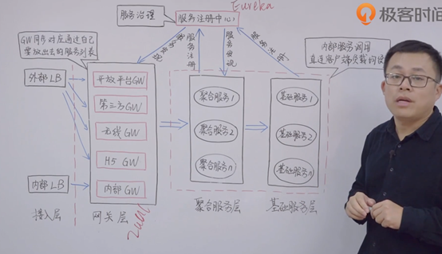
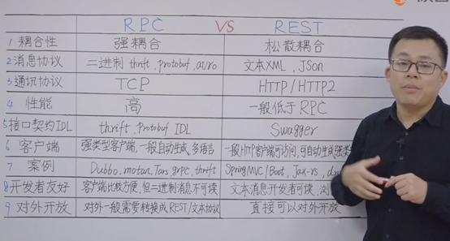
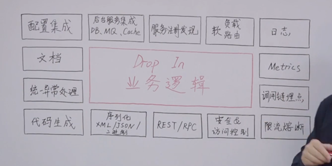
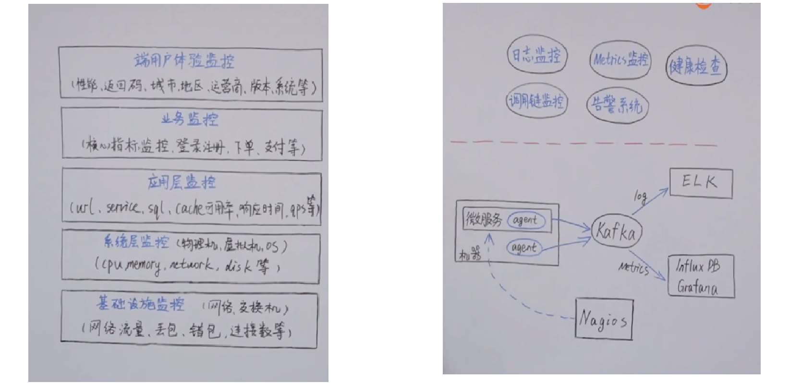

## 互联网架构演进 

架构演进过程呈：单体 -> 水平分层、面向服务 -> 微服务 -> 服务网格

### 单体架构

- 系统耦合性高
- 技术选型单一
- 开发效率越来越低下

### 水平分层架构

> 水平方向拆分（功能维度），垂直方向拆分（业务维度）

- 水平方向物理分成多个独立进程
  -  网关层
  - 业务逻辑层
  - 数据访问层
  - 数据存储层

- 每层逻辑解耦 

有同步和异步的方式，异步架构通过在业务逻辑层后增加**业务消息队列层**,提升吞吐量

缺点：每层的业务过粗 

### 面向服务 

-  组件模型；不同功能单元（服务）通过定义良好的接口关联 
- 接口采用中立的方式定义，独立于硬件平台、操作系统和编程语言 

缺点：

-  业务垂直方向拆分
  - 每个服务还是个Monoliths

- 对ESB(企业服务总线)严重依赖 

### 微服务 

> 多个业务逻辑层、数据访问层和DB/Cache

- 业务关注服务间“通信“
  -  业务迭代速度变慢 
- 基础设施组件升级困难
  - 影响基础设置团队的交付能力和交付速度
- 多编程语言之间”通信问题“
  - 业务每种语言一套基础设施，成本过大 

### 服务网格架构 

> 服务网格是一个基础设施层，用于处理服务间通信。服务网格通常是一组轻量级网络代理，对应用程序透明

- 一套基础设施支持多语言开发 
- Service Mesh独立进程、独立升级

## 微服务扫盲
>  AknoledgeMents :[杨波：微服务架构](https://www.bilibili.com/video/BV1FZ4y1H7yb?p=15)

微服务架构

- 一组小的服务
- 独立的进程
- 轻量级通信
- 基于业务的能力
- 独立部署
- 无集中式管理

优点：

- 强模块胡边界

- 可独立部署
- 技术多样性

缺点：

- 分布式复杂性
- 最终一致性
- 运维复杂性
- 测试复杂性

阿里微服务中台：

微服务总体技术架构体系：

API服务网关:

注册发现：

通信方式：

业务逻辑（服务治理）：

监控分层与监控架构：

集中配置：携程APollo配置中心

熔断、隔离、限流、分级：

部署发布：蓝绿、灰度

镜像治理：Docker