# 计算机原理+操作系统+计算机网络

## 一  计算机原理

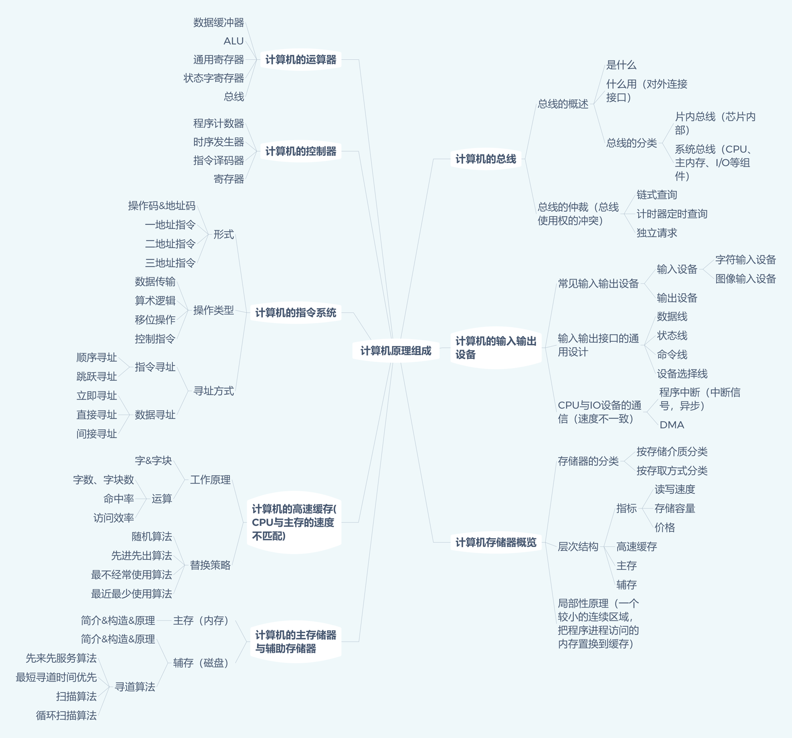


## 二 操作系统

### 2.1  操作系统概述

- 什么是操作系统 

  管理硬件、提供用户交互的软件系统

- 操作系统的基本功能
  - 管理资源（处理器资源、IO设备资源、存储器资源、文件资源）
  - 抽象资源
  - 提供用户操作接口

- 基本概念
   - 并发性 : 
      - 并发：同一时间间隔，多线程 
      - 并行：同一时刻，多进程1
  - 共享性:  
    - 资源共享
    - 互斥共享与同时访问形式
  - 虚拟性 : 
    - 时分复用（虚拟处理器技术和虚拟设备技术）；
    - 空分复用（虚拟磁盘（逻辑磁盘C,D））、虚拟内存
  - 异步性 


### 2.2 进程管理 

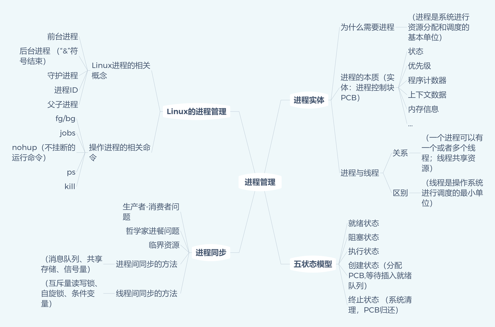


> 一些概念 

- **进程的上下文**（执行活动全过程的静态描述）：已执行过的进程指令和数据在相关[寄存器](http://baike.baidu.com/view/6159.htm)与[堆栈](http://baike.baidu.com/view/93201.htm)中的内容称为上文，把正在执行的指令和数据在寄存器和堆栈中的内容称为正文，把待执行的指令和数据在寄存器与堆栈中的内容称为下文 

- **进程的五状态模型**

  	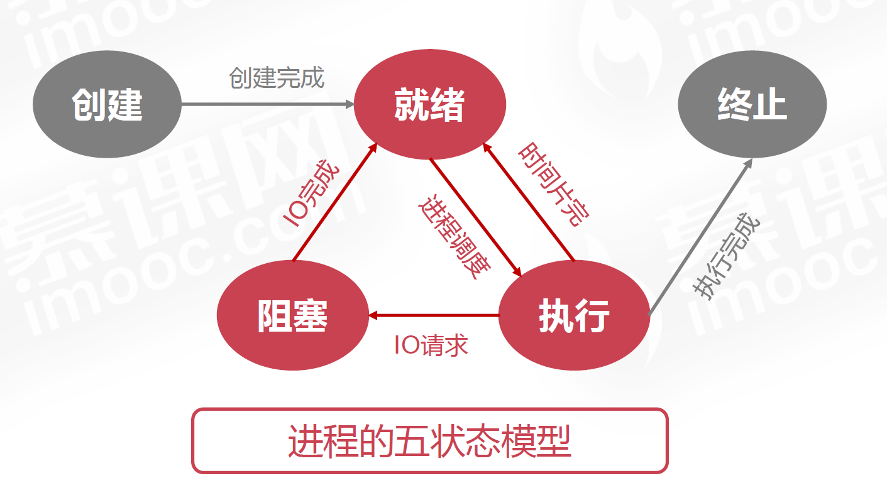


由于创建或撤销进程时，**系统**都要为之分配或回收资源，如内存空间、I/O 设备等，所付出的开销远大于创建或撤销线程时的开销。类似地，在进行进程切换时，涉及当前执行进程 CPU 环境的保存及新调度进程 **CPU 环境的设置**，而线程切换时只需保存和设置少量寄存器内容，开销很小 

在微内核结构下，操作系统被划分成小的、定义良好的模块，只有微内核这一个模块运行在内核态，其余模块运行在用户态。


系统调用和中断的关系就在于，当进程发出系统调用申请的时候，会产生一个软件中断。产生这个软件中断以后，系统会去对这个软中断进行处理，这个时候进程就处于核心态了

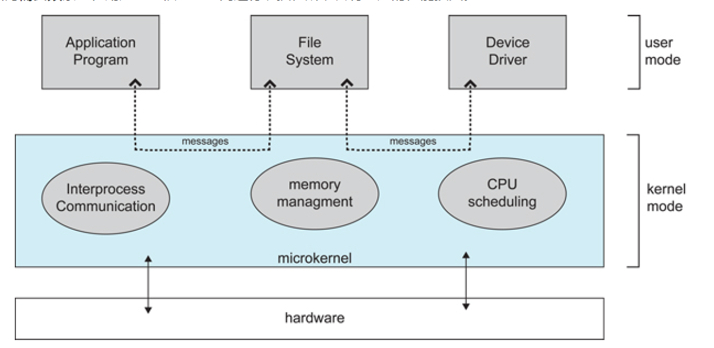


进程通信:

-  管道
- FIFO, 命名管道，去除了管道只能在父子进程中使用的限制
- 消息队列
- 信号量
- 共享存储
- 套接字 


### 2.3 作业管理（进程调度和死锁） 

**进程调度**是指计算机通过决策决定哪个就绪进程可以获得**CPU 使用权**

**死锁**是指两个或两个以上的进程在执行过程中，由于竞争资源或者由于彼此通信而造成
的一种**阻塞的现象**，若无外力作用，它们都将无法推进下去。此时称系统处于死锁状态
或系统产生了死锁，这些永远在互相等待的进程称为死锁进程。

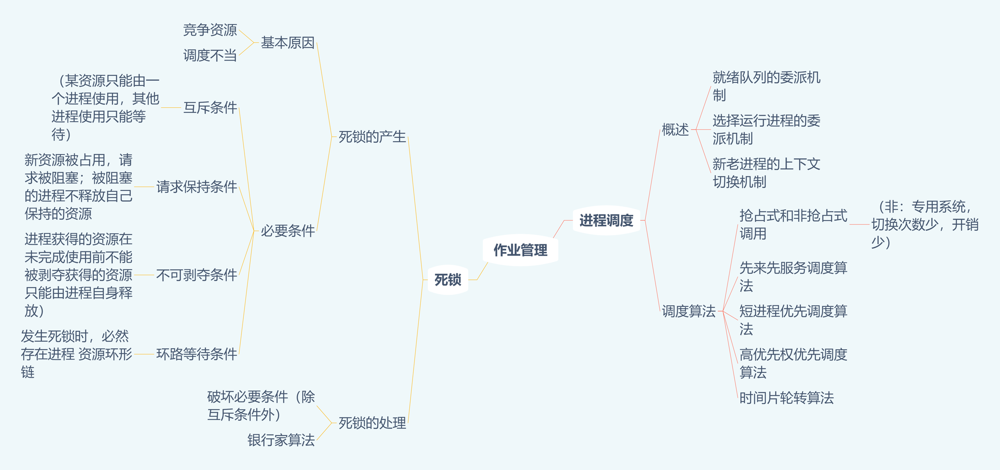

[TODO // 银行家算法的实现和细化]


### 2.4 存储管理（内存分配和回收）

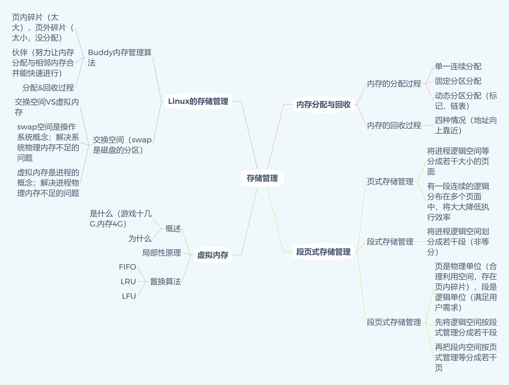

**局部性原理**是指CPU 访问存储器时，无论是**存取指令**还是**存取数据** ，所访问的存储单元都 趋于聚集在一个较小的连续区域中

**虚拟内存**：

- 把程序使用内存划分，将部分暂时不使用的内存放置在辅存
- 程序运行时，无需全部装入内存，装载部分即可
- 如果访问页不在内存，则发出缺页中断，发起页面置换	

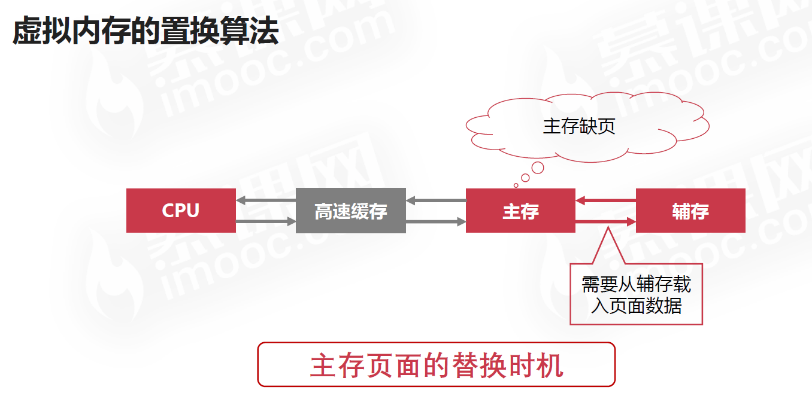

- 替换策略发生在 Cache-主存层次、主存-辅存层次
- Cache-主存层次的替换策略主要是为了解决 **速度问题**
- 主存-辅存层次主要是为了解决 **容量问题**

[TODO // 细化]

### 2.5  文件设备管理

了解即可

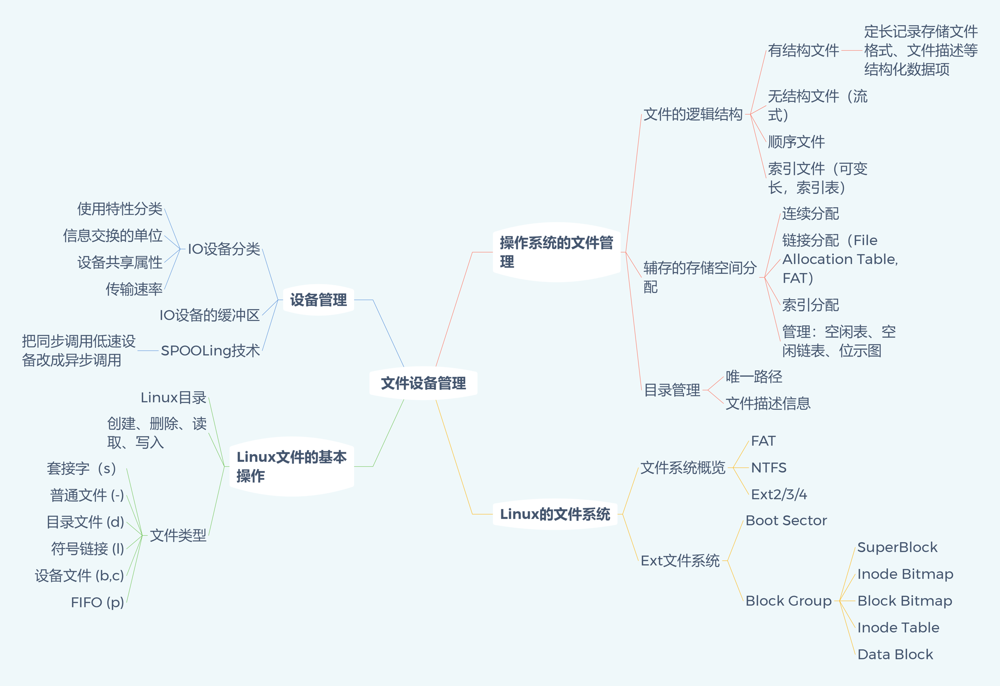


#  三 计算机网络

>  数据传输过程应该是“自顶而下”（这里应该有本书），这里“自下而上分析”

## 3.1 计算机网络概述（了解一下）

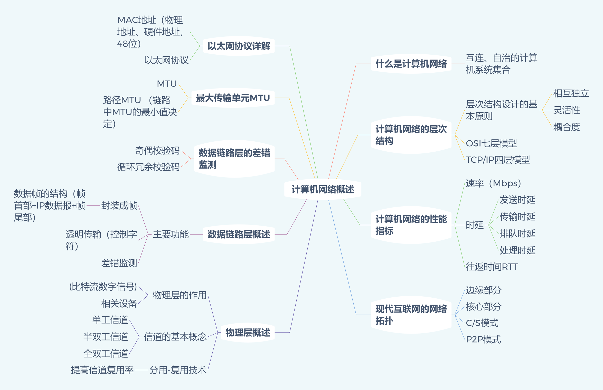

TCP/IP四层模型，网络接口层包括了5层模型的物理层和数据链路层


## 2 网络层 

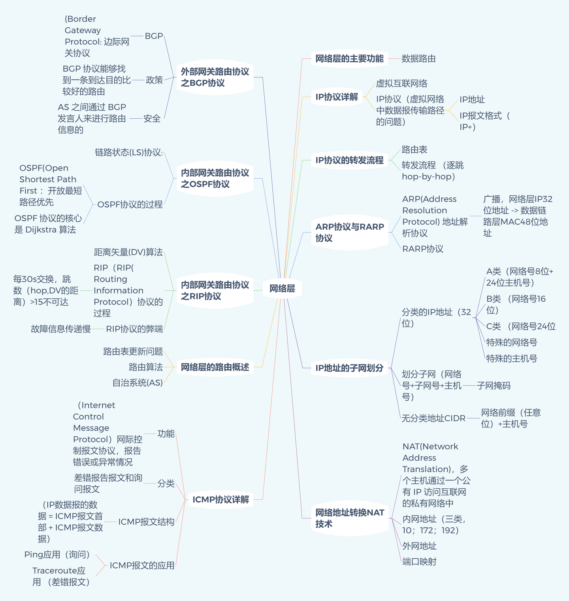


[Wake-Up](https://github.com/wolverinn/Waking-Up/blob/master/Computer%20Network.md) 这个库**每个问题下的一连串追问**，网络层的几个问题：
- IP地址的分类

  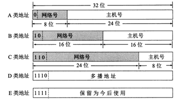

- 什么叫划分子网

  -  通过在主机号字段中拿一部分作为子网号，把两级 IP 地址划分为三级 IP 地址。
     IP 地址 ::= {< 网络号 >, < 子网号 >, < 主机号 >}
  -  要使用子网，必须配置子网掩码。一个 B 类地址的默认子网掩码为 255.255.0.0，如果 B 类地址的子网占两个比特，那么子网掩码为 11111111 11111111 11000000 00000000，也就是 255.255.192.0。注意，外部网络看不到子网的存在 

-  什么叫做无分类地址 

   -  无分类编址 CIDR 消除了传统 A 类、B 类和 C 类地址以及划分子网的概念，使用网络前缀和主机号来对 IP 地址进行编码，网络前缀的长度可以根据需要变化。
   -  IP 地址 ::= {< 网络前缀号 >, < 主机号 >}
      CIDR 的记法上采用在 IP 地址后面加上网络前缀长度的方法，例如 128.14.35.7/20 表示前 20 位为网络前缀。
   -  CIDR 的地址掩码可以继续称为子网掩码，子网掩码首 1 长度为网络前缀的长度 

- 什么是ARP协议

  -  ARP 实现由 32位IP 地址得到 48位MAC 地址 
  -  每个主机都有一个 ARP 高速缓存，里面有本局域网上的各主机和路由器的 IP 地址到 MAC 地址的映射表。如果主机 A 知道主机 B 的 IP 地址，但是 ARP 高速缓存中没有该 IP 地址到 MAC 地址的映射，此时主机 A 通过**广播的方式**发送 ARP 请求分组，主机 B 收到该请求后会发送 ARP 响应分组给主机 A 告知其 MAC 地址，随后主机A向其高速缓存中写入主机 B 的 IP 地址到 MAC 地址的映射

- 什么是NAT？

  -  用于解决内网中的主机要和因特网上的主机通信。由NAT路由器将主机的本地IP地址转换为全球IP地址，分为静态转换（转换得到的全球IP地址固定不变）和动态NAT转换
  -  为了更有效地利用全球 IP 地址，现在常用的 NAT 转换表把运输层的端口号也用上了，使得多个专用网内部的主机共用一个全球 IP 地址。使用端口号的 NAT 也叫做网络地址与端口转换 NAPT 

- 什么是RIP？

  -  RIP是应用层协议 
  -  每个路由器维护一张表，记录该路由器到其它网络的”跳数“，路由器到与其直接连接的网络的跳数是1，每多经过一个路由器跳数就加1；更新该表时和相邻路由器交换路由信息；路由器允许一个路径最多包含15个路由器，如果跳数为16，则不可达。交付数据报时优先选取距离最短的路径


## 3 传输层 

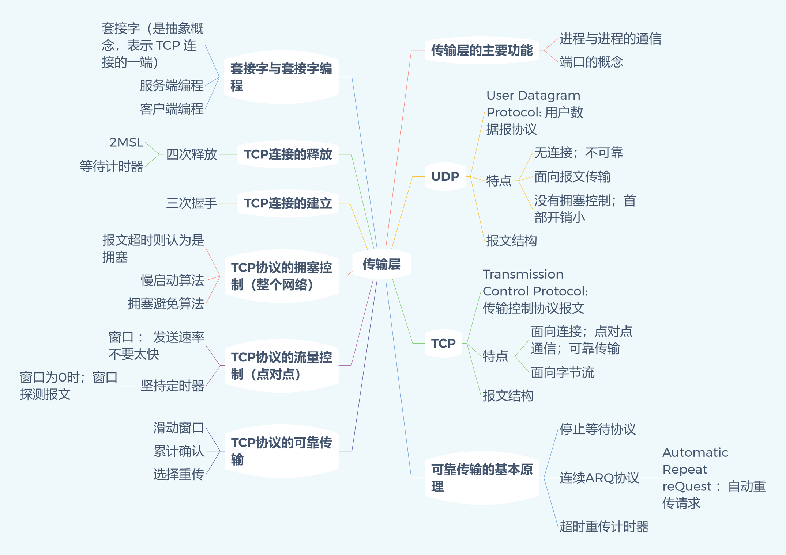

继续Waking Up的问答:

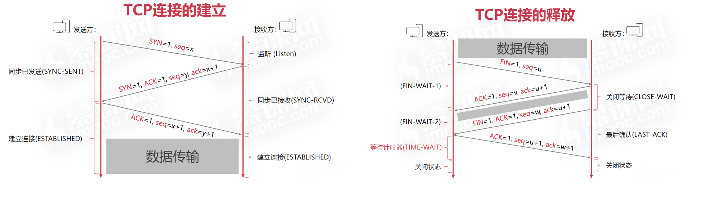

- 什么是三次握手？为什么发送方要发出第三个确认报文呢？

  - 第三次握手是为了防止实效的连接请求到达服务器，让服务器错误打开连接。
  - 客户端发送的连接请求如果在网络中滞留，那么就会隔很长一段时间才能收到服务器端发回的连接确认。客户端等待一个超时重传时间之后，就会`重新请求连接`。但是这个滞留的连接请求最后还是会到达服务器，如果不进行三次握手，那么服务器就会`打开两个连接`。如果有第三次握手，客户端会忽略服务器之后发送的对滞留连接请求的连接确认。

- 什么是四次挥手？为什么需要等待2MSL？

  - 客户端发送给了`FIN` 连接释放报文，服务器收到这个报文，就进入了`CLOSE-WAIT`状态。这个状态是为了让服务器端发送还未出传送完毕的数据，传送数据完毕之后，服务器会发送`FIN`连接释放信号。
  - 客户端接收到服务器端的 FIN 报文后进入此状态，此时并不是直接进入 CLOSED 状态，还需要等待一个时间计时器设置的时间 2MSL。
    - 确保最后一个确认报文能够到达。如果`Server`没有收到·`Client`发送来的确认报文，那么就会重新发送释放请求报文，`Client` 等待一段时间就是为了处理这种情况的发生。
    - 等待一段时间还为了让本连接持续时间内所产生的所有报文都从网络中消失，使得下一个新的连接不会出现旧的连接请求报文。（报文在互联网里面存活的时间是有限的，旧的报文会影响下一次的连接）
    - TIME_WAIT 过多会出现什么问题，怎么解决 ? 
      - 如果在 **高并发，多短链接**情景下，TIME_WAIT 就会过多，导致端口被持续占用，用户连接不上服务器 
      - 可以通过调整内核参数解决： vi /etc/sysctl.conf 加入以下内容设置：
        `net.ipv4.tcp_tw_reuse = 1 net.ipv4.tcp_tw_recycle = 1`
        - reuse 是表示是否允许重新应用处于 TIME-WAIT 状态的 socket 用于新的 TCP 连接
        - recyse 是加速TIME-WAIT sockets回收TIME_WAIT 状态是主动关闭连接的一方（Client）出现的，不要轻易去使用上边两个参数。
      - 先看看是不是可以在应用层面重用TCP连接来尽量避免这个问题（ 比如 HTTP 的 KeepAlive技术）

- TCP如何实现流量控制？

- TCP的拥塞控制是如何实现的？

- TCP与UDP的区别？

  - TCP 面向连接，传输数据之前要需要建立会话。UDP 是无连接的。
  - TCP 提供可靠传输，保证数据不丢包、不重复且按顺序到达；UDP 只尽努力交付，不保证可靠交付
  3. TCP 是面向字节流的；UDP 面向报文。
  4. TCP 只支持点到点通信；UDP 支持一对一、一对多、多对多的交互通信。
  5. TCP 首部开销大 20 字节，UDP 首部开销小 8 字

- TCP如何保真传输的可靠性？

  - 超时重传
  2. 差错校验
  3. 流量控制（为了让接收方能来得及接收）
  - 拥塞控制（为了降低整个网络的拥塞程度）
    1. 慢开始
    2. 拥塞避免
    3. 快重传
    4. 快恢复
  5. 滑动窗口与数据包编号排序

- TCP 粘包与拆包 

  TCP 拆包、粘包：TCP 数据包发送到接收端的时候可能存在**多个包一起接收**，这就叫粘包。也存在一个数据包被分为**好几次接收**，这就叫拆包。 发生的原因：
  1. 要发送的数据大于 TCP 发送缓冲区剩余空间大小，将会发生拆包
  2. 待发送数据大于最大报文长度，TCP 在传输前将进行拆包
  3. 待发送的数据小于 TCP 发送缓冲区的大小，TCP 将多次写入缓冲区的数据一次发送出去，将会发生粘包
  4. 接收数据端的应用层没有及时读取接收缓冲区中的数据，将发生粘包

  解决办法：
  1. 发送端给每个数据包添加包首部，首部里面包含该数据包的大小
  2. 发送端将每个数据包封装为固定长度（不够的补0）
  3. 给发送的数据包添加首尾分界符

- TCP的滑动窗口 

  > 窗口是缓存的一部分，用来暂时存放字节流。
  >
  > 发送方和接收方各有一个窗口，接收方通过 TCP 报文段中的窗口字段告诉发送方自己的窗口大小，发送方根据这个值和其它信息设置自己的窗口大小。
  >
  > 发送窗口内的字节都允许被发送，接收窗口内的字节都允许被接收。如果发送窗口左部的字节已经发送并且收到了确认，那么就将发送窗口向右滑动一定距离，直到左部第一个字节不是已发送并且已确认的状态；接收窗口的滑动类似，接收窗口左部字节已经发送确认并交付主机，就向右滑动接收窗口。
  >
  > 接收窗口只会对窗口内最后一个【按序到达】的字节进行确认，例如接收窗口已经收到的字节为{31, 34, 35}，其中 {31} 按序到达，而 {34, 35} 就不是，因此只对字节 31 进行确认。发送方得到一个字节的确认之后，就知道这个字节之前的所有字节都已经被接收 
  >
  > 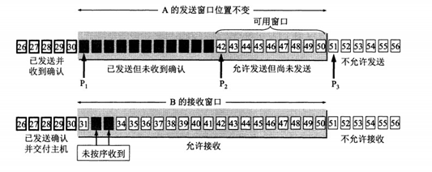

  - 作用：

    1. 实现了 TCP 的可靠性：对发送的数据进行编号与确认以及超时重传

    2. 流量控制：窗口大小随链路情况不断变化

- TCP 窗口其他特点：

  1. 有两个窗口，一个发送、一个接收。

  2. 全双工通信

  3. 第一次接受方窗口大小是由链路带宽决定的

  4. 当窗口过大时，会导致不必要的数据来拥塞我们的链路，但是窗口太小时，会造成很大的延时

##  4 应用层 

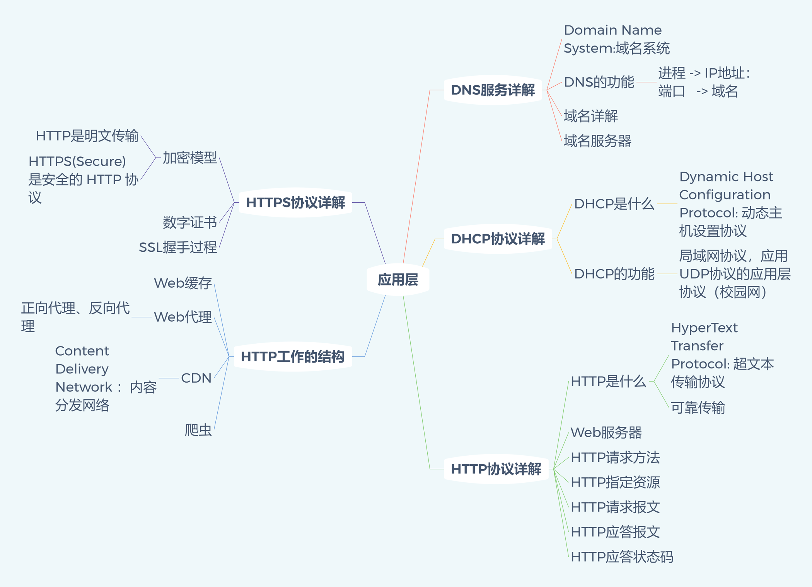

继续Waking Up的问题：

- http和https有什么区别 ？

  - HTTPS协议是由SSL+HTTP协议构建的可进行加密传输、身份认证的网络协议，要比http协议安全。  

  - http是超文本传输协议，信息是明文传输，https则是具有安全性的ssl加密传输协议。 

  - http和https使用的是完全不同的连接方式，用的端口也不一样，前者是80，后者是443

- HTTP 1.0、1.1、2.0 的区别

  - HTTP 1.0：
    1. 无状态、无连接。每次通信之后立刻断开连接，导致需要反复建立 TCP 连接
    2. 由于 HTTP1.0 规定下一个请求必须在前一个请求响应到达之前才能发送。假设前一个请求响应一直不
    到达，那么下一个请求就不发送，同样的后面的请求也给阻塞了。 
  - HTTP 1.1
    1. TCP 可以复用了 keep-alive
    2. 为了修补（不是修复）1.0 时代请求阻塞的问题，1.1 支持请求管道化，也就是不需要等待上一个请求响应了再发送下一个请求。1.1 的做法就是把这个请求队列放到服务端上，服务端还是先处理第一个请求，再处理第二个请求。
    3. 明文传输。通过抓包工具可以截获报文，可以看到传输的数据。即使加密了也能看到乱码，反正可以看到文字
    4. 还是没有解决无状态连接 
    5. 现阶段的浏览器之所以使用 1.1 加载数据不慢，除了网速快以外，还有一个原因就是浏览器运行开多个TCP 同时执行 HTTP 请求，Chrome 浏览器默认支持 6 个 TCP 同时请求数据。 
  - HTTP 2.0
    1. 主要优点有采用二进制帧封装，传输变成多路复用，流量控制算法优化，服务器端推送，首部压缩，优
    先级等特点
    2. 不管对同一个域名访问多少文件，所有的请求都是通过一个 TCP 连接并发完成。当然这里面一定存在
    请求的优先级排序以及流量控制（滑动窗口）
    3. 服务器给建立连接的客户端主动发送数据，无需客户端确认请求

- get与post的区别？

  ```
  - GET用于获取数据，POST用于提交数据;
  - GET的参数长度有限制（不同的浏览器和服务器限制不同），POST没有限制
  - GET把参数包含在URL中，POST通过封装参数到请求体中发送；
  - GET请求只能进行URL编码，而POST支持多种编码方式。
  - GET可以发送的参数只能是ASCII类型，POST没有限制，甚至可以传输二进制。
  - GET比POST更不安全，因为参数直接暴露在URL上，所以不能用来传递敏感信息;
  - GET刷新无害，而POST会再次提交数据
  ```

- Session 与Cookie的区别？

  - cookie 数据存放在客户的浏览器上，session 数据放在服务器上 
  - cookie 不是很安全，别人可以分析存放在本地的 cookie 并进行欺骗 
  - session 会在一定时间内保存在服务器上。当访问增多，会比较占用你服务器的性能 
  - 单个 cookie 保存的数据不能超过 4K，很多浏览器都限制一个站点最多保存 20 个 cookie 
  - 如何实现session共享
    - 通过负债均衡策略
      - 通过 ip Hash，将同一个用户一直转发到同一台机器上，确保 session 生效
      - 通过第三方存储，如 Redis 

- 从输入网址到获得页面的过程？

  1. 浏览器查询 DNS，获取域名对应的IP地址；
  2. 浏览器获得域名对应的IP地址以后，浏览器向服务器请求建立链接，发起三次握手；
  3. TCP/IP链接建立起来后，浏览器向服务器发送HTTP请求；
  4. 服务器接收到这个请求，并根据路径参数映射到特定的请求处理器进行处理，并将处理结果及相应的视图返回给浏览器；
  5. 浏览器解析并渲染视图，若遇到对js文件、css文件及图片等静态资源的引用，则重复上述步骤并向服务器请求这些资源；
  6. 浏览器根据其请求到的资源、数据渲染页面，最终向用户呈现一个完整的页面

- HTTP请求有哪些常见状态码 ？

  | 状态码         |               类别               | 原因短语                   |
  | :------------- | :------------------------------: | -------------------------- |
  | 1xx 报告       |  Informational（信息性状态码）   | 接收的请求正在处理         |
  | 2xx 成功       |      Success（成功状态码）       | 请求正常处理完毕           |
  | 3xx 重定向     |   Redirection（重定向状态码）    | 需要进行附加操作以完成请求 |
  | 4xx 客户端出错 | Client Error（客户端错误状态码） | 服务器无法处理请求         |
  | 5xx 服务器出错 | Server Error（服务器错误状态码） | 服务器处理请求出错         |

- 什么是长链接 

  - HTTP 是无状态的，所以长链接指的不是 http，而是 TCP 长链接
  - 为什么需要长链接：
    - 主要是为了复用 TCP 连接，避免每一次 http 请求都要重新建立一次 TCP 连接，浪费资源。
    - 举例：访问一个页面需要 N 个资源，会发起 N 个 http 请求。以前的短连接会发出多个 TCP连接，现在只需要一个 TCP 长链接就可以完成这 N 个 http 资源请求。
  - 长轮询与短轮询
    - 其实都是客户端不断的去访问服务器某些资源，不同的是服务端的反应
    - 短轮询时代：服务端收到请求后处理完毕就断开
    - 长轮询时代：服务端收到请求后如果没有查到需要的资源，会将连接挂起，直到得到数据或超时